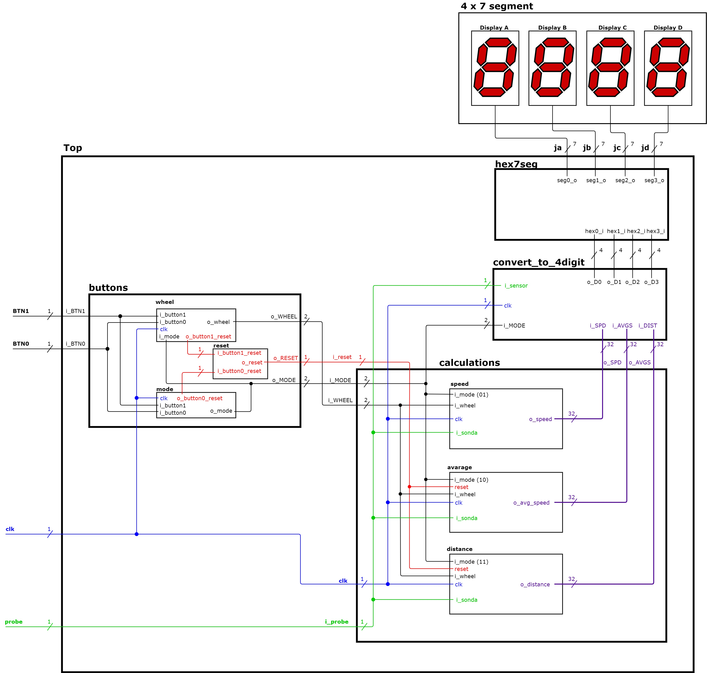

# Projekt-DE1 - 3. zadání
## Konzole pro rotoped/kolo s LCD displejem

### Členové týmu

- Hrubešová Diana
- Hrubý Jan
- Hykš Matěj
- Hynšt Boris

[Link na náš Github](https://github.com/mrhyks/Projekt-DE1-3)

### Cíle projektu

Cílem projektu je vytvořit konzoli pro rotoped či kolo s hallovou sondou. Pro zobrazování výstupu jako je 
rychlost, průměrná rychlost a ujetá vzdálenost jsme zvolili čtyři sedmi-segmentové displeje.

**Jednotlivé body projektu:**

**- Dvě tlačítka:**
*   Prvním tlačítkem (btn0) se dá vybrat nastavení poloměru kola a mód zobrazení displeje. Mód 0 - Nastavení velikosti kola; Mód 1 - Zobrazení rychlosti; Mód 2 - Zobrazení průměrné rychlosti; Mód 3 - Zobrazení ujeté vzdálenosti
*   Druhým tlačítkem (btn1) se dá vybrat poloměr kola, kdy kolo se dá vybrat jen v případě, že je vybraný mód 0
                
**- "Reset tlačítko"**
*   V případě, že uživatel chce resetovat data a začít znovu (neresetuje se nastavený mód a kola) stačí držet obě tlačítka po dobu dvou a více sekund, resetuje se ujetá vzdálenost a průměrná rychlost.
               
**- Výstup** 
*   Výstup změřené a vypočítané rychlosti, průměrné rychlosti a vzdálenosti získané pomocí hallovy sondy do 4x 7 segment displej. 

**- Možnost volby průměru kola**

## Popis Hardwaru

Jako vývojovou desku jsme vybrali Arty A7 35. 

Pro zobrazování výstupu by jsme použili 2x Pmod SSD (4x 7 segmentový displej), které by byly napojené na Pmod porty JA - JB, JC - JD. 

## Popis a simulace modulů VHDL

### Blokové schéma finální aplikace

### Modul `buttons.vhd`

Modul slouží jako sjednocení bloků `mode.vhd`, `wheel.vhd` a `reset.vhd`. Do modulu jsou přivedeny signáli z tlačítek (btn0 a btn1) a signál z hodin (clk).

Z obrázku simulace lze vidět, že při módu (s_MODE) jiným než 0 se nedá měnit velikost kola. Dále je tam vidět reset, pokud se obě tlačítka drží po dobu 2 a více sekund. 

**Simulace modulu**

**Odkazy:**
 
- [Design](https://github.com/mrhyks/Projekt-DE1-3/blob/main/DE1-3/console/console.srcs/sources_1/new/buttons.vhd)
- [Testbench](https://github.com/mrhyks/Projekt-DE1-3/blob/main/DE1-3/console/console.srcs/sim_1/new/tb_buttons.vhd)
        
#### Modul `mode.vhd` 

Modul `mode.vhd` je modul, ve kterým se volí mód zobrazení výstupu na displeje a mód na volbu kola. Tento modul využívá hlavně tlačítko btn0, ale je zde řešen jeden ze dvou reset signálů do modulu `reset.vhd`, který se vyšle jen tehdy, pokud je tlačítko btn0 a btn1 stisknuté po dobu 2 a více sekund.
To je řešeno pomocí časovače, který je spuštěný clk každých 10 ms po dobu 2 sekund a poté je vyslán signál resetu. 

**Simulace modulu**

**Odkazy:**
 
- [Design](https://github.com/mrhyks/Projekt-DE1-3/blob/main/DE1-3/console/console.srcs/sources_1/new/mode.vhd)
- [Testbench](https://github.com/mrhyks/Projekt-DE1-3/blob/main/DE1-3/console/console.srcs/sim_1/new/tb_mode.vhd)

#### Modul `wheel.vhd` 

Do modulu `wheel.vhd` je přiveden signál zvoleného módu z `mode.vhd`. Pokud je mód 0, tak se dá volit rozměr kola. Pokud není mód 0, nelze volit rozměr kola, ale je možné provést reset, pokud je tlačítko btn0 a btn1 stisknuté po dobu 2 a více sekund. 

**Simulace modulu**

**Odkazy:**

- [Design](https://github.com/mrhyks/Projekt-DE1-3/blob/main/DE1-3/console/console.srcs/sources_1/new/wheel.vhd)
- [Testbench](https://github.com/mrhyks/Projekt-DE1-3/blob/main/DE1-3/console/console.srcs/sim_1/new/tb_wheel.vhd)

#### Modul `reset.vhd` 

Pokud je do modulu `reset.vhd` přiveden zároveň signál pro reset z `mode.vhd` a `wheel.vhd`, modul vyšle signál resetu do modulu `calculations.vhd`   

**Simulace modulu**

**Odkazy:**
 
- [Design](https://github.com/mrhyks/Projekt-DE1-3/blob/main/DE1-3/console/console.srcs/sources_1/new/reset.vhd)
- [Testbench](https://github.com/mrhyks/Projekt-DE1-3/blob/main/DE1-3/console/console.srcs/sim_1/new/tb_reset.vhd)

### Modul `calculations.vhd`

Modul slouží jako sjednocení bloků `speed.vhd`, `average.vhd` a `distance.vhd`. Do modulu je přiveden signál z hallovi, z hodin (clk), signály z modulu `buttons.vhd` mode a wheel.

Z obrázku simulace lze vidět, že hodnoty průměrné rychlosti (s_AVGS), aktuální rychlosti (s_SPD) a vzdálenosti (s_DIST) se zobrazují jen tehdy, pokud je zvolen jejich mód, jinak ukazují hodnotu 0. Dále lze vidět, když nastal restart (3,5 s), tak se hodnoty vynulovaly. 

**Simulace modulu**

**Odkazy:**
 
- [Design](https://github.com/mrhyks/Projekt-DE1-3/blob/main/DE1-3/console/console.srcs/sources_1/new/calculations.vhd)
- [Testbench](https://github.com/mrhyks/Projekt-DE1-3/blob/main/DE1-3/console/console.srcs/sim_1/new/tb_calculations.vhd)

#### Modul `speed.vhd`   

Modul `speed.vhd` není ovlivněn signálem z resetu, protože ukazuje aktuální rychlost, která se aktualizuje každých 10 ms. Rychlost je zobrazena v Módu 1. I když je rychlost v simulaci zobrazena v jednotkách tisíců např. 1424, tak vyjadřuje hodnotu 14,24 km/h. 

**Simulace modulu**

**Odkazy:**
 
- [Design](https://github.com/mrhyks/Projekt-DE1-3/blob/main/DE1-3/console/console.srcs/sources_1/new/speed.vhd)
- [Testbench](https://github.com/mrhyks/Projekt-DE1-3/blob/main/DE1-3/console/console.srcs/sim_1/new/tb_speed.vhd)

#### Modul `average.vhd` 

Modul `average.vhd` zobrazuje průměrnou rychlost uživatele za celou dobu, která je ovlivněná frekvencí šlapání, ujetou vzdáleností a zvoleným mód kola. Průměrná rychlost je zobrazena v Módu 2. Průměrná rychlost v simulaci je zobrazena v jednotkách tisíců např. 1424, ale reálně vyjadřuje hodnotu 14,24 km/h.

**Simulace modulu**

**Odkazy:**
 
- [Design](https://github.com/mrhyks/Projekt-DE1-3/blob/main/DE1-3/console/console.srcs/sources_1/new/average.vhd)
- [Testbench](https://github.com/mrhyks/Projekt-DE1-3/blob/main/DE1-3/console/console.srcs/sim_1/new/tb_average.vhd)

#### Modul `distance.vhd` 

V modulu `distance.vhd` se řeší ujetá vzdálenost, která je závyslá na zvolené velikosti kola. Zobrazená vzdálenost v simulaci je nastavena v jednotkách desítek metrů (10 m). 

**Simulace modulu**

**Odkazy:** 

- [Design](https://github.com/mrhyks/Projekt-DE1-3/blob/main/DE1-3/console/console.srcs/sources_1/new/distance.vhd)
- [Testbench](https://github.com/mrhyks/Projekt-DE1-3/blob/main/DE1-3/console/console.srcs/sim_1/new/tb_distance.vhd)

### Modul `convert_to_4digit.vhd` 

V modulu `convert_to_4digit.vhd` se signál speed, average speed a distance konvertuje z 32b na 4b tak, aby bylo možné použít 4x 7seg displej. Modul postupně odečítá hodnotu ze získaného signálu, dokud nebude 0. 

**Simulace modulu**

**Odkazy:** 

- [Design](https://github.com/mrhyks/Projekt-DE1-3/blob/main/DE1-3/console/console.srcs/sources_1/new/convert_to_4digit.vhd)
- [Testbench](https://github.com/mrhyks/Projekt-DE1-3/blob/main/DE1-3/console/console.srcs/sim_1/new/tb_convert_to_4digit.vhd)

### Modul `hex7seg.vhd` 

Modul `hex7seg.vhd` slouží k demonstraci 4x 7 segmentových displejů, překládá 4 bitové hodnoty z `convert_to_4digit.vhd` na zapínání jednotlivých částí na sedmi segmentovým displeji.

**Odkazy:** 

- [Design](https://github.com/mrhyks/Projekt-DE1-3/blob/main/DE1-3/console/console.srcs/sources_1/new/hex7seg.vhd)
- [Testbench](https://github.com/mrhyks/Projekt-DE1-3/blob/main/DE1-3/console/console.srcs/sim_1/new/tb_hex_7seg.vhd)

## Popis a simulace TOP modulu

Modul `top.vhd` spojuje moduly `buttons.vhd`, `calculations.vhd`,`hex7seg.vhd` a `convert_to_4digit.vhd`. Do modulu `buttons.vhd` přivádí signál z tlačítek a clk, do `calculations.vhd` mode, reset a wheel z modulu `buttons.vhd`. Dále je přiveden signál ze Hallovi sondy a clk. Signály průměrné rychlosti, rychlosti a ujeté vzdálenosti z `calculations.vhd` jsou přivedeny do modulu `convert_to_4digit.vhd`, kde jsou rozděleny na jednotlivé číslice o 4 bitech a vyvedeny do `hex7seg.vhd`, kde se překládají pro zobrazení na 4x 7-segment displejích.

**Simulace modulu**
- 0 - 10s

- 10 - 20s

- 20 - 30s

**Odkazy:** 

- [Design](https://github.com/mrhyks/Projekt-DE1-3/blob/main/DE1-3/console/console.srcs/sources_1/new/top.vhd)
- [Testbench](https://github.com/mrhyks/Projekt-DE1-3/blob/main/DE1-3/console/console.srcs/sim_1/new/tb_top.vhd)

## Video

[Odkaz](https://drive.google.com/file/d/1CwY5artjyWuxMTzwrxVljAfrGmFoBiob/view)

## Reference

   1. [Arty A7 reference manual](https://reference.digilentinc.com/reference/programmable-logic/arty-a7/reference-manual)
   2. [Digilent Pmod Interface Specification](https://www.digilentinc.com/Pmods/Digilent-Pmod_%20Interface_Specification.pdf)
   4. [Pmod Hardware Compatibility Guide](https://reference.digilentinc.com/pmod/hardware_compatibility)
   5. [Pmod SSD](https://reference.digilentinc.com/reference/pmod/pmodssd/start)